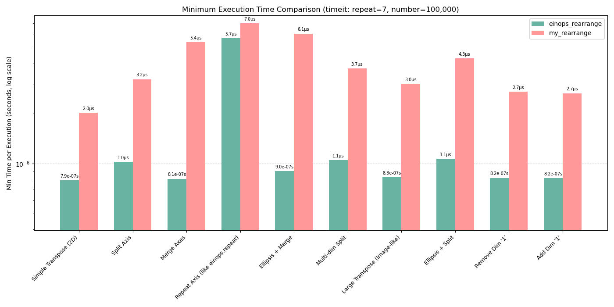

# Custom Einops `rearrange` Implementation for NumPy

Submitted by: Deepak, AI Junior @ NITK, Surathkal

## Approach

The implementation largely is inspired by the original implementation of `rearrange` function in the `einops` library.
The original implementation can handle multiple backends (NumPy, PyTorch, TensorFlow), but this version is specifically tailored for NumPy arrays. This implementation also supports the functionality of `repeat` which is not available in the original implementation of `rearrange`.

Drawing from the original implementation, the core logic operates in two main phases:

1.  **Recipe Preparation (`_prepare_rearrange_recipe`):**
    *   **Parsing:** The input `pattern` string is parsed using the `ParsedExpression` class to identify left/right sides, axis names, parentheses `()`, anonymous dimensions `1`, and ellipsis `...`. It determines the structural "composition" of axes.
    *   **Analysis:** It analyzes the parsed structure against the input tensor's rank (`ndim`). It resolves ellipsis, identifies axes to be kept, dropped, repeated, or inserted. It determines the sequence of required NumPy operations.
    *   **Caching:** The result of this analysis (an immutable `RearrangeRecipe` object) is cached using `functools.lru_cache`. This avoids redundant parsing and analysis for repeated calls with the same pattern signature (pattern, ndim, axes lengths keys).

2.  **Execution (`rearrange`):**
    *   **Recipe Retrieval:** Fetches the cached `RearrangeRecipe` if available, or prepares a new one if not.
    *   **Size Inference:** Calculates the concrete size of each axis based on the input `tensor.shape` and any provided `**axes_lengths`. It validates shape compatibility during this step.
    *   **NumPy Operations:** Executes the plan defined in the recipe using efficient NumPy functions in a specific order:
        1.  Optional initial `reshape` (for splitting axes).
        2.  Optional `np.squeeze` (for dropping input dimensions of size 1).
        3.  Optional `np.transpose` (for reordering remaining axes).
        4.  Optional `np.expand_dims` (for inserting new dimensions of size 1).
        5.  Optional `np.broadcast_to` (for repeating axes / implementing newly created axes from a size-1 source).
        6.  Final `reshape` (for merging axes into the desired output structure).

## Supported Operations 

*   **Reshaping:** Achieved implicitly through the combination of other operations (splitting, merging, dropping, inserting, transposing) determined by the pattern.
*   **Transposition:** Handled by `np.transpose` using a permutation calculated during recipe preparation. 
*   **Splitting Axes:** Implemented via the *initial* `np.reshape`. Parentheses on the left side of the pattern (e.g., `(h w)`) signal splitting, requiring necessary axis lengths in `**axes_lengths` to determine the target shape for this reshape.
*   **Merging Axes:** Implemented via the *final* `np.reshape`. Parentheses on the right side (e.g., `-> (h w)`) signal merging. The sizes inferred or provided for the elementary axes within the parentheses are multiplied to calculate the size of the merged dimension.
*   **Repeating Axes:** Handles creating new axes on the right side (e.g., `a 1 c -> a b c`) like in the `repeat` function of the `einops` library. This is done by broadcasting the size-1 source axis to the new size, which is inferred or provided in `**axes_lengths`.

## Parsing (`ParsedExpression`)

*   **Input/Output Axes:** Identifies named axes (identifiers) and anonymous axes ('1') on both sides of the `->`.
*   **Ellipsis Recognition:** Detects `...` and replaces it internally for easier processing during analysis and expansion based on `ndim`.
*   **Elementary Operations:** Parses parentheses `()` to understand grouping (for splitting/merging) and spaces/`1` to understand dimension structure. It doesn't directly parse "operations" but rather the structure from which the operations are derived in `_prepare_rearrange_recipe`.

## Error Handling

*   A custom `EinopsError` subclass of `ValueError` is used for specific, informative messages.
*   Checks are implemented for:
    *   **Invalid Patterns:** Syntax errors (mismatched parens, invalid chars/identifiers, incorrect ellipsis, missing '->').
    *   **Shape Mismatches:** Incompatibility between pattern structure and tensor `ndim`, non-divisible dimensions during splitting, incorrect size products.
    *   **Axis Lengths:** Missing required `**axes_lengths` for splitting/new axes, conflicting provided lengths, non-integer/non-positive lengths.
    *   **Identifier Issues:** Duplicate identifiers, dropping non-'1' axes, creating axes without a size-1 source for repetition.

## Optimization & Design

*   **Caching:** The primary optimization is caching the `RearrangeRecipe` via `functools.lru_cache` in `_prepare_rearrange_recipe`, dramatically speeding up repeated calls.
*   **Readability:** Helper functions (like `_determine_drops_and_mapping`) are used to structure the complex recipe preparation logic. The two-pass analysis in `_prepare...` simplifies handling the interaction between dropped axes and repetition sources.

## Unit Tests

*   Comprehensive unit tests are provided using Python's `unittest` module.
*   Tests cover:
    *   Basic operations (transpose, split, merge, add/drop 1, repeat).
    *   Ellipsis usage.
    *   Edge cases (scalar input, empty arrays, zero-sized dimensions).
    *   Complex combined patterns.
    *   Extensive error condition checking for invalid patterns and shape mismatches.
*   Where available, test results are compared against the reference `einops` library implementation for correctness using `np.testing.assert_array_equal`.

## How to Run

1.  Simply run the notebook `einops_custom_rearrange.ipynb`. It has the implementation, unit tests and efficiency benchmarking.
2. Clone the repo, install the dependencies and run the file `test_rearrange.py` to run the tests. Example on how to use the module below:
   ```python
   import numpy as np
   from custom_rearrange_implementation import rearrange, EinopsError

   # Example:
   x = np.random.rand(1, 4, 5)
   y = rearrange(x, 'a b c -> a b c 1')

   print(y)
   
   ```

# Benchmarking


Although the custom implementation is not as fast as the original one, it performs competitively for all use cases and handles all edge cases.
